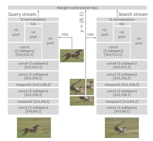

# 单目标跟踪（SOT）

单目标跟踪：确定视频帧序列的初始帧中目标的状态，预测后续序列目标的状态

难点：
- 遮挡
- 模糊
- 形变
- 尺度变化
- 背景干扰
- ...

方法
- 生成式：通过特征学习得到目标的外观模型，在后续帧中进行模板匹配，寻找最匹配区域。比较著名的生成式方法有卡尔曼滤波、粒子滤波、均值漂移等。但生成式方法没有考虑帧中的背景信息。
  - ASMS DAT
- 判别式：转换为二分类问题，训练一个目标与背景的特征提取器，在后续帧中通过对目标与背景提取特征做出判断
  - Struck TLD
- 相关滤波：利用初始帧的目标区域特征训练滤波器，在后续帧中进行相同区域的特征提取，然后在频域中对提取到的特征进行相关滤波操作，将响应图中得分最大的区域作为目标区域
  - KCF DCF
- 深度学习
  - 孪生网络
    - 加入Attention进行改进
    - 加入anchor-base进行改进
    - 加入anchor-free进行改进
  - 循环网络
  - 生成式网络

主要介绍深度学习相关的单目标跟踪

- SINT
  孪生网络的开山鼻祖，利用第一帧的patch与后续帧的候选patch进行匹配，通过**通用的**学习函数返回最相似的patch
  - 网络结构
    - 
    - 整个网络分为了两个分：Query与Search，两个分支一摸一样（所以叫孪生网络）
    - 论文中提到了在低层特征中使用MaxPool有利于保持局部特征噪声的鲁棒性，但是会影响图像的分辨率（对于分类任务来说影响可能不大，但是对于定位，跟踪任务对于分辨率还是有一定的要求）
    - 使用了ROI Pool来快速的处理候选区域
    - 低层特征以及高层特征的多层输出作为中间表示
    - 在损失函数之前加入归一化，避免输出值大范围波动。最终设计了AlexNet-like small net以及VGG-like large net（如上图所示）
  - 数据集
    - Query：视频中随机选择一帧并打上标签
    - Search：随机选择一帧，并不需要与Query帧相邻